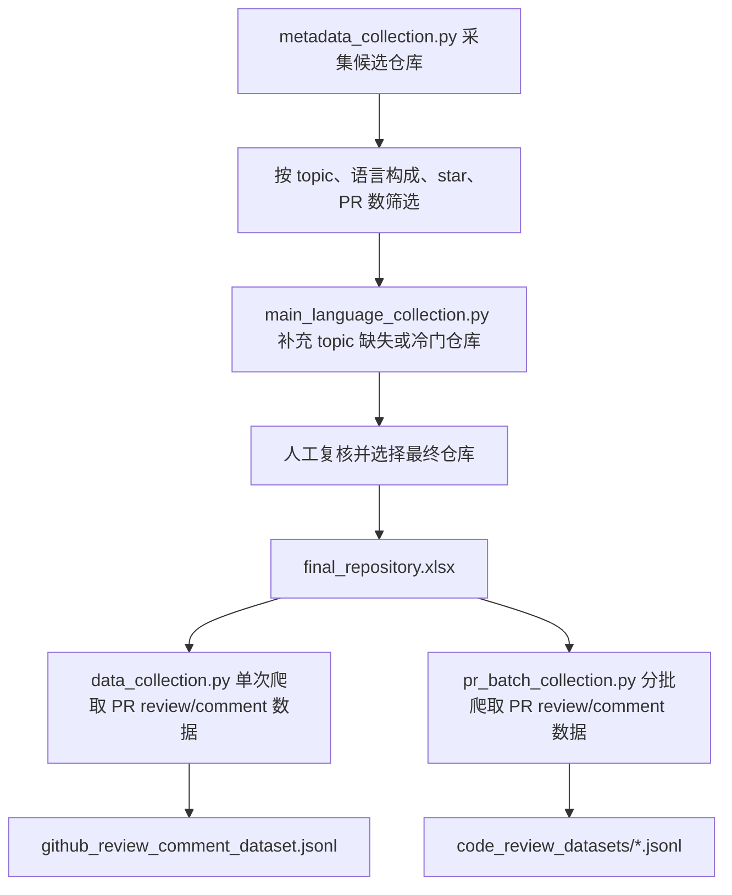

# GitHub 硬件仓库与 Review Comment 数据集构建说明

本文档说明当前项目的端到端数据构建流程：先采集并筛选硬件相关 GitHub 仓库，再基于最终仓库列表爬取 PR review、inline comment 和普通 PR comment，生成可用于后续分析的 JSON 数据集。

## 1. 端到端流程

整体流程如下：



其中：

- `metadata_collection.py` 负责主仓库元数据采集与自动筛选。
- `main_language_collection.py` 用于补充 topic 缺失或 topic 较冷门但主语言明确相关的仓库。
- `final_repository.xlsx` 是人工选择后的最终仓库列表。
- `data_collection.py` 基于最终仓库列表一次性爬取 PR review、inline review comment 和普通 PR conversation comment。
- `pr_batch_collection.py` 基于同一套爬取逻辑，按“仓库序号 + PR 位置区间”分批采集，适合全量数据集构建、断点续跑和多批次并行。

## 2. 运行方式

当前脚本不在代码中保存 GitHub token。运行时统一通过 `--github-token` 参数传入。

主元数据采集：

```powershell
python metadata_collection.py --github-token <your_github_token>
```

第一语言补充采集：

```powershell
python main_language_collection.py --github-token <your_github_token>
```

Review/comment 数据集爬取：

```powershell
python data_collection.py --github-token <your_github_token>
```

`data_collection.py` 现在默认输出 JSONL：

```text
code_review_datasets/github_review_comment_dataset.jsonl
```

小规模测试可限制仓库数和 PR 数：

```powershell
python data_collection.py --github-token <your_github_token> --max-repos 1 --max-prs-per-repo 5
```

分批爬取某个仓库的一段 PR：

```powershell
python pr_batch_collection.py --github-token <your_github_token> --repo-index 1 --pr-start 1 --pr-end 100
```

其中 `--repo-index` 是输入仓库表中的 1-based 仓库序号，默认输入仍是 `final_repository.xlsx`；`--pr-start` 和 `--pr-end` 是该仓库在指定排序下的 1-based PR 位置区间，包含首尾。默认排序为 `--pr-sort updated --pr-direction desc`，默认输出到 `code_review_datasets/` 下的分片文件。

为了让多次运行的 PR 区间更稳定，正式分批时建议显式固定排序方式，例如：

```powershell
python pr_batch_collection.py --github-token <your_github_token> --repo-index 1 --pr-start 1 --pr-end 100 --pr-sort created --pr-direction asc
```

分批脚本默认输出 JSONL，适合追加写入和断点续跑。中断后可使用相同参数加 `--resume` 继续：

```powershell
python pr_batch_collection.py --github-token <your_github_token> --repo-index 1 --pr-start 1 --pr-end 100 --pr-sort created --pr-direction asc --resume
```

不要将真实 token 写入代码、README 或公开仓库。

## 3. 元数据筛选简述

`metadata_collection.py` 通过 GitHub Search API 构造候选仓库池，候选来源包括：

- 硬件相关语言查询，例如 `language:Verilog`、`language:SystemVerilog`、`language:VHDL`、`language:Bluespec`、`language:Scala`、`language:Tcl`、`language:Smarty`。
- 硬件相关 topic 查询，例如 `topic:verilog`、`topic:systemverilog`、`topic:vhdl`、`topic:chisel`、`topic:fpga`、`topic:asic`、`topic:hdl`、`topic:rtl`、`topic:risc-v`、`topic:riscv`、`topic:soc`、`topic:processor`、`topic:cpu` 等。

候选仓库会按 `full_name` 去重，然后通过 GitHub languages API 统计前三语言，并获取 PR 数。核心筛选条件为：

```text
stars >= 500
top3_has_required_hdl == True
pr_count >= 200
```

本次主元数据采集运行输出为：

```text
Output: metadata\metadata_collection\github_hardware_language_projects.xlsx
Filtered project count: 122
Total PR count: 332703
Output: metadata\metadata_collection\github_hardware_language_projects.csv
```

## 4. 第一语言补充与人工选择

仅依赖 topic 可能遗漏两类仓库：

- 仓库没有维护 topic，或 topic 字段为空。
- 仓库使用了较冷门、项目自定义或框架相关的 topic，未被主流程 topic 查询覆盖。

因此额外使用 `main_language_collection.py` 按目标语言进行补充检索。该脚本会记录 `target_language`、`primary_language`、`primary_language_matches_target`、`top3_languages`、`topics`、`stars`、`forks_count`、`pr_count` 等字段。

补充结果随后经过人工检查，重点查看：

- 仓库是否确实属于硬件语言、CPU、SoC、RISC-V、RTL/HDL 方向。
- 主语言和前三语言是否与目标方向一致。
- topic、项目描述、star、PR 数和仓库活跃度是否合理。

人工选择后的最终仓库列表保存为：

```text
final_repository.xlsx
```

当前 `final_repository.xlsx` 包含 44 个仓库，字段为：

```text
repo_name, full_name, topics, url, stars, forks_count, pr_count
```

## 5. Review/Comment 数据集爬取逻辑

`data_collection.py` 默认读取：

```text
final_repository.xlsx
```

脚本会优先读取 `full_name` 字段；如果没有 `full_name`，则从 `url` 字段解析 `owner/repo`。

对每个仓库，脚本按如下顺序爬取数据：

1. 通过 GitHub Pull Requests API 获取仓库全部 PR。
2. 对每个 PR 获取 PR 基本信息，包括 PR 编号、标题、描述、作者、状态、分支、commit sha 和时间信息。
3. 通过 PR Reviews API 获取 top-level review，记录整体 review 内容和 review 状态。
4. 通过 PR Review Comments API 获取 inline review comment，记录评论所在文件、行号、diff hunk、old code 和 new code。
5. 通过 Issues Comments API 获取普通 PR conversation comment。
6. 使用 GitHub GraphQL reviewThreads 查询 inline comment 所属讨论是否 resolved；无法获取时写入 `null`。
7. 将所有记录统一写入 JSONL；如显式指定 `--format json`，也可输出 JSON 数组。

默认输出为：

```text
code_review_datasets/github_review_comment_dataset.jsonl
```

如果确实需要旧版 JSON 数组格式，可显式指定：

```powershell
python data_collection.py --github-token <your_github_token> --format json --output code_review_datasets/github_review_comment_dataset.json
```

已有 JSON 数组文件可以用 `json_to_jsonl.py` 流式转换为 JSONL：

```powershell
python json_to_jsonl.py code_review_datasets\part_01_11.json
```

批量转换 `code_review_datasets/` 下所有 JSON 数组文件：

```powershell
python json_to_jsonl.py "code_review_datasets\*.json" --overwrite
```

转换脚本默认在原文件旁边生成同名 `.jsonl` 文件，例如 `part_01_11.json` 会生成 `part_01_11.jsonl`。它按记录流式读取，不会一次性把 100MB 以上的大 JSON 数组整体加载进内存。

### 5.1 `pr_batch_collection.py` 的必要性

`final_repository.xlsx` 当前包含多个高活跃仓库，PR 总量很大。直接用 `data_collection.py` 全量爬取时，常见问题包括：

- 单次运行时间过长，容易受到网络波动、GitHub API rate limit 或本地中断影响。
- 全量结果集中写入一个 JSON 文件时，失败后恢复成本较高。
- 不方便把不同仓库或不同 PR 区间拆分给多个进程、机器或时间窗口执行。
- 某个 PR 爬取失败时，难以只重跑失败的小范围任务。

因此，正式构建数据集时建议使用 `pr_batch_collection.py`。该脚本复用 `data_collection.py` 中的 `GitHubClient`、仓库读取逻辑和单个 PR 记录抽取逻辑，但把采集单位缩小为“一个仓库的一段 PR”。这样可以更稳定地分批生成数据分片，并保留每个 PR 的成功或失败日志。

### 5.2 `pr_batch_collection.py` 运行方式

最小运行命令：

```powershell
python pr_batch_collection.py --github-token <your_github_token> --repo-index 1 --pr-start 1 --pr-end 100
```

常用参数如下：

| 参数 | 含义 |
| --- | --- |
| `--github-token` | GitHub API token |
| `--input` | 仓库输入表，默认使用 `final_repository.xlsx` |
| `--repo-index` | 仓库在输入表中的 1-based 序号 |
| `--pr-start` / `--pr-end` | PR 位置区间，1-based 且包含 `pr-end` |
| `--output` | 输出路径；不指定时自动写入 `code_review_datasets/` |
| `--format` | 输出格式，支持 `json` 和 `jsonl`，默认 `jsonl` |
| `--request-sleep` | 每次 API 请求之间的等待秒数，默认 `0.2` |
| `--pr-sort` | PR 排序字段，支持 `created`、`updated`、`popularity`、`long-running`，默认 `updated` |
| `--pr-direction` | 排序方向，支持 `asc` 和 `desc`，默认 `desc` |
| `--resume` | 基于 progress log 跳过已成功的 PR，仅支持 `jsonl` |
| `--progress-log` | 成功和失败进度日志路径，默认是 `<output>.progress.jsonl` |
| `--failed-log` | 失败 PR 日志路径，默认是 `<output>.failed.jsonl` |
| `--skip-reviews` | 跳过 top-level PR review |
| `--skip-inline-comments` | 跳过 inline review comment |
| `--skip-pr-comments` | 跳过普通 PR conversation comment |

默认输出文件名包含仓库名、仓库序号和 PR 区间，例如：

```text
code_review_datasets/<owner>_<repo>_repo001_prs0001_0100.jsonl
code_review_datasets/<owner>_<repo>_repo001_prs0001_0100.jsonl.progress.jsonl
code_review_datasets/<owner>_<repo>_repo001_prs0001_0100.jsonl.failed.jsonl
```

其中：

- 主 JSONL 文件每行是一条 review/comment 记录。
- `progress.jsonl` 记录每个 PR 的成功或失败状态，`--resume` 会根据其中的成功记录跳过已完成 PR。
- `failed.jsonl` 只记录失败 PR，便于后续单独检查或重跑。

正式分批时，同一批次的重跑和续跑必须保持相同的 `--repo-index`、`--pr-start`、`--pr-end`、`--pr-sort` 和 `--pr-direction`。如果仓库仍在活跃更新，建议使用 `--pr-sort created --pr-direction asc`，减少新增或更新 PR 导致位置漂移的风险。

## 6. Review/Comment 数据字段

`github_review_comment_dataset.jsonl` 中每行代表一条 PR review 或 comment。核心字段包括：

| 字段 | 含义 |
| --- | --- |
| `repo` | 仓库完整名，格式为 `owner/repo` |
| `repo_url` | 仓库 URL |
| `pr_id` | GitHub PR 内部 ID |
| `pr_number` | PR 编号 |
| `pr_url` | PR 页面 URL |
| `pr_title` | PR 标题 |
| `pr_description` | PR 描述 |
| `pr_state` | PR 状态 |
| `author` | PR 作者 |
| `base_ref` / `head_ref` | PR 目标分支和来源分支 |
| `base_sha` / `head_sha` | PR 目标和来源 commit sha |
| `comment_type` | 评论类型：`review`、`inline_comment`、`pr_comment` |
| `review_id` | review ID |
| `comment_id` | comment ID |
| `review_state` | review 状态，如 `APPROVED`、`CHANGES_REQUESTED`、`COMMENTED` |
| `review_comment` | review/comment 正文 |
| `review_time` | review/comment 时间 |
| `reviewer` | reviewer 或评论者 |
| `file_path` | inline comment 所在文件路径 |
| `commit_id` | comment 对应 commit |
| `comment_line` | inline comment 所在行 |
| `old_code` | diff hunk 中解析出的旧代码片段 |
| `new_code` | diff hunk 中解析出的新代码片段 |
| `diff` | GitHub API 返回的原始 diff hunk |
| `is_resolved` | inline thread 是否 resolved；不可用时为 `null` |
| `comment_url` | comment 或 review URL |

## 7. 当前爬取结果

当前完整数据集按仓库序号分成 4 个 JSONL 分片：

```text
code_review_datasets\part_01_11.jsonl
code_review_datasets\part_12_22.jsonl
code_review_datasets\part_23_33.jsonl
code_review_datasets\part_34_44.jsonl
```

使用 `count_review_records.py --dedupe` 对 01-44 全部分片统计，去重后结果为：

| 指标 | 数值 |
| --- | ---: |
| 总记录数 | 186844 |
| top-level review 记录数 | 19390 |
| inline review comment 记录数 | 109292 |
| 普通 PR conversation comment 记录数 | 58162 |
| 覆盖仓库数 | 42 |
| 有记录 PR 数 | 26613 |
| 去重跳过记录数 | 8 |

这里的 `有记录 PR 数` 不是 `final_repository.xlsx` 中的 `pr_count` 总量。`final_repository.xlsx` 的 `pr_count` 合计为 57503，表示 44 个目标仓库在元数据阶段统计到的全部 PR 数；而 26613 只统计最终 JSONL 中实际出现过至少一条 `review`、`inline_comment` 或 `pr_comment` 记录的 PR。两者相差 30890，主要因为：

- 很多 PR 没有任何可写入的 review/comment 正文，脚本不会为这类 PR 输出空记录。
- top-level review 只有非空 `body` 才写入；例如只有无正文 `APPROVED` 的 review 不会生成记录。
- `inline_comment` 和 `pr_comment` 也会跳过空正文。
- 44 个目标仓库中有 2 个仓库没有生成任何记录：`ultraembedded/riscv` 和 `riscv-mcu/e203_hbirdv2`，它们在最终仓库表中的 `pr_count` 合计为 32。

因此，当前数据集覆盖的是“有实际 review/comment 文本或行内评论内容的 PR”，不是所有被枚举到的 PR。

`comment_type = "review"` 的 review state 分布为：

| review_state | 数量 |
| --- | ---: |
| `APPROVED` | 13215 |
| `COMMENTED` | 4478 |
| `CHANGES_REQUESTED` | 1530 |
| `DISMISSED` | 167 |

各分片统计如下：

| 文件 | 记录数 | review | inline_comment | pr_comment | 覆盖仓库数 | 有记录 PR 数 |
| --- | ---: | ---: | ---: | ---: | ---: | ---: |
| `part_01_11.jsonl` | 32678 | 2264 | 16442 | 13972 | 11 | 5897 |
| `part_12_22.jsonl` | 120153 | 14000 | 77012 | 29141 | 10 | 14004 |
| `part_23_33.jsonl` | 19268 | 1341 | 7101 | 10826 | 11 | 4066 |
| `part_34_44.jsonl` | 14745 | 1785 | 8737 | 4223 | 10 | 2646 |

未去重的原始统计为 186852 条记录，其中普通 PR conversation comment 为 58170 条；去重后减少的 8 条重复记录均来自 `part_23_33.jsonl`。

当前目录中的 `github_review_comment_dataset.json` 是早期 JSON 数组样例文件；新的默认输出文件名为 `github_review_comment_dataset.jsonl`。

| 文件 | 记录数 | 覆盖仓库数 | comment 类型分布 |
| --- | ---: | ---: | --- |
| `github_review_comment_dataset.json` | 343 | 1 | `review`: 171, `inline_comment`: 125, `pr_comment`: 47 |

当前样例结果已经包含 `inline_comment` 记录；这类记录会额外包含文件路径、行号、diff hunk、旧代码片段、新代码片段和 `is_resolved` 等字段。

## 8. 当前 CSV/XLSX 产物汇总

当前 `metadata/` 目录中的 CSV 和 XLSX 结果文件如下：

| 文件 | 类型 | 行数 | 主要字段 |
| --- | --- | ---: | --- |
| `metadata\final_repository.xlsx` | xlsx | 44 | `repo_name`, `full_name`, `topics`, `url`, `stars`, `forks_count`, `pr_count` |
| `metadata\metadata_collection\github_hardware_language_projects.csv` | csv | 122 | `repo_name`, `full_name`, `top3_languages`, `top3_has_required_hdl`, `topics`, `url`, `stars`, `forks_count`, `pr_count` |
| `metadata\metadata_collection\github_hardware_language_projects.xlsx` | xlsx | 122 | `repo_name`, `full_name`, `top3_languages`, `top3_has_required_hdl`, `topics`, `url`, `stars`, `forks_count`, `pr_count` |
| `metadata\main_language_collection\github_scala_projects.csv` | csv | 465 | `repo_name`, `full_name`, `target_language`, `primary_language`, `primary_language_matches_target`, `top3_languages`, `topics`, `url`, `stars`, `forks_count`, `pr_count` |
| `metadata\main_language_collection\github_scala_projects.xlsx` | xlsx | 465 | `repo_name`, `full_name`, `target_language`, `primary_language`, `primary_language_matches_target`, `top3_languages`, `topics`, `url`, `stars`, `forks_count`, `pr_count` |
| `metadata\main_language_collection\github_systemverilog_projects.csv` | csv | 36 | `repo_name`, `full_name`, `target_language`, `primary_language`, `primary_language_matches_target`, `top3_languages`, `topics`, `url`, `stars`, `forks_count`, `pr_count` |
| `metadata\main_language_collection\github_systemverilog_projects.xlsx` | xlsx | 36 | `repo_name`, `full_name`, `target_language`, `primary_language`, `primary_language_matches_target`, `top3_languages`, `topics`, `url`, `stars`, `forks_count`, `pr_count` |
| `metadata\main_language_collection\github_verilog_projects.csv` | csv | 82 | `repo_name`, `full_name`, `target_language`, `primary_language`, `primary_language_matches_target`, `top3_languages`, `topics`, `url`, `stars`, `forks_count`, `pr_count` |
| `metadata\main_language_collection\github_verilog_projects.xlsx` | xlsx | 82 | `repo_name`, `full_name`, `target_language`, `primary_language`, `primary_language_matches_target`, `top3_languages`, `topics`, `url`, `stars`, `forks_count`, `pr_count` |
| `metadata\main_language_collection\github_vhdl_projects.csv` | csv | 24 | `repo_name`, `full_name`, `target_language`, `primary_language`, `primary_language_matches_target`, `top3_languages`, `topics`, `url`, `stars`, `forks_count`, `pr_count` |
| `metadata\main_language_collection\github_vhdl_projects.xlsx` | xlsx | 24 | `repo_name`, `full_name`, `target_language`, `primary_language`, `primary_language_matches_target`, `top3_languages`, `topics`, `url`, `stars`, `forks_count`, `pr_count` |

核心数值汇总：

| 项目 | 数值 |
| --- | ---: |
| 主元数据筛选仓库数 | 122 |
| 主元数据筛选仓库 `pr_count` 合计 | 332703 |
| 第一语言补充候选仓库数合计 | 607 |
| 人工筛选后的最终仓库数 | 44 |
| 最终仓库列表 `pr_count` 合计 | 57503 |

其中：

- `github_hardware_language_projects.*` 是主元数据筛选结果。
- `github_*_projects.*` 是按第一语言补充检索得到的候选结果。
- `final_repository.xlsx` 是人工筛选后的最终仓库列表，也是 `data_collection.py` 的默认输入。
- `github_review_comment_dataset.jsonl` 是 `data_collection.py` 新的默认 review/comment 数据集输出格式。
- `json_to_jsonl.py` 用于把已有 JSON 数组文件转换成 JSONL，方便后续合并、断点处理和训练读取。
