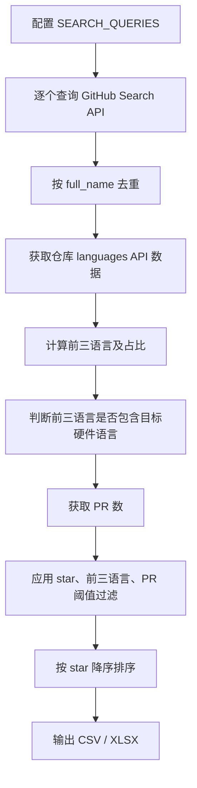

# GitHub 仓库元数据采集与筛选流程说明

本文档描述当前主逻辑 `metadata_collection.py` 的采集、筛选和输出流程。整体目标是从 GitHub 中收集与硬件描述语言、CPU、SoC、RISC-V、RTL/HDL 等方向相关的仓库，并通过 topic、语言构成、star 数和 PR 数筛选出更可能符合研究需求的项目。

## 1. 主逻辑说明

当前主逻辑文件是：

```text
metadata_collection.py
```

该脚本负责生成最终主结果：

```text
github_hardware_language_projects.csv
github_hardware_language_projects.xlsx
```

本目录中还存在其他历史或辅助脚本，但当前文档只说明 `metadata_collection.py`，不展开其他脚本逻辑。

## 2. 复现运行方式

当前脚本不在代码中保存 GitHub token。运行时需要通过 `--github-token` 参数传入 token：

```powershell
python metadata_collection.py --github-token <your_github_token>
```

其中 `<your_github_token>` 替换为本地终端中的 GitHub token。不要将真实 token 写入代码或文档中。

## 3. 本次运行输出

根据终端输出，本次 `metadata_collection.py` 运行结果为：

```text
Output: D:\c++\LLM4SE\github_hardware_language_projects.xlsx
Filtered project count: 194
Total PR count: 371722
Output: D:\c++\LLM4SE\github_hardware_language_projects.csv
```

也就是说，最终筛选后得到 194 个仓库，合计 PR 数为 371722，并同时输出了 CSV 和 Excel 两个结果文件。

## 4. 主流程概览

`metadata_collection.py` 的整体流程如下：



## 5. 初始候选来源

主脚本通过 `SEARCH_QUERIES` 构造候选仓库池。候选来源包括语言查询和 topic 查询。

当前语言查询包括：

```text
language:Verilog
language:SystemVerilog
language:VHDL
language:Bluespec
language:Scala
language:Tcl
language:Smarty
```

当前 topic 查询包括：

```text
topic:verilog
topic:systemverilog
topic:vhdl
topic:bluespec
topic:chisel
topic:spinalhdl
topic:amaranth
topic:nmigen
topic:circt
topic:fpga
topic:asic
topic:hdl
topic:rtl
topic:risc-v
topic:riscv
topic:soc
topic:softcore
topic:soft-core
topic:processor
topic:cpu-core
topic:cpucore
topic:cpu
topic:vector
topic:ara
topic:rvv
topic:scala
topic:riscv-boom
topic:boom
topic:rocket-chip
topic:riscv32imfc
topic:systemverilog-hdl
topic:rv64gc
topic:ariane
topic:nuclei
topic:core
topic:e203
topic:hummingbird
topic:rv32
topic:openrisc
topic:vhdl
```

不同查询得到的仓库会按 `full_name` 去重。一个仓库即使同时命中多个语言或 topic，也只会在候选池中保留一次。

## 6. 查询与数量限制

当前主脚本的关键配置为：

```text
MAX_PAGES_PER_QUERY = 20
MAX_TOTAL_ITEMS = 3000
MIN_STARS = 500
MIN_PR_COUNT = 200
SORT = stars
ORDER = desc
```

查询 GitHub Search API 时，每个 query 会附加 star 下限：

```text
{query} stars:>=500
```

每个 query 最多抓取 20 页，每页 100 条。所有 query 合并后，最多保留 3000 个去重后的候选仓库。

## 7. 语言统计逻辑

脚本会调用 GitHub languages API 获取每个仓库的语言字节数：

```text
GET /repos/{owner}/{repo}/languages
```

随后按字节数从高到低排序，取前三种语言，并格式化为：

```text
Verilog(72.4%),Python(18.1%),Makefile(4.2%)
```

该字段最终写入：

```text
top3_languages
```

## 8. 目标硬件语言判断

当前 `REQUIRED_HDL_LANGUAGES` 包含：

```text
verilog
systemverilog
vhdl
bluespec
scala
smarty
```

判断逻辑为：

```python
top3_languages = get_top_languages_list(languages_map, top_n=3)
normalized_top3 = {
    normalize(language)
    for language in top3_languages
    if normalize(language)
}
top3_has_required_hdl = bool(normalized_top3 & REQUIRED_HDL_LANGUAGES)
```

如果前三语言中包含上述目标语言之一，则：

```text
top3_has_required_hdl = True
```

## 9. PR 数统计逻辑

脚本使用 GitHub issue search API 估算仓库 PR 总数：

```text
repo:{owner}/{repo} is:pr
```

对应输出字段为：

```text
pr_count
```

该指标用于衡量仓库协作活跃度和工程规模。

## 10. 核心筛选条件

候选仓库进入最终结果前，需要满足以下条件：

```text
stars >= 500
top3_has_required_hdl == True
pr_count >= 200
```

代码中的核心判断为：

```python
if row["top3_has_required_hdl"] and int(row.get("pr_count", 0) or 0) >= MIN_PR_COUNT:
    rows.append(row)
```

其中 star 下限在搜索 query 和循环中都进行了约束。

## 11. 输出字段

`github_hardware_language_projects.csv` 包含以下字段：

| 字段 | 含义 |
| --- | --- |
| `repo_name` | 仓库短名称 |
| `full_name` | GitHub 完整仓库名，格式为 `owner/repo` |
| `top3_languages` | 按代码字节数统计的前三语言及占比 |
| `top3_has_required_hdl` | 前三语言是否包含目标硬件相关语言 |
| `topics` | 仓库 topic 列表 |
| `url` | GitHub 仓库地址 |
| `stars` | star 数 |
| `forks_count` | fork 数 |
| `pr_count` | PR 总数估算 |

当前结果文件头部样例包括：

| repo_name | full_name | top3_languages | pr_count |
| --- | --- | --- | --- |
| `the-algorithm` | `twitter/the-algorithm` | `Scala(66.2%),Java(19.7%),Starlark(5.5%)` | `568` |
| `spark` | `apache/spark` | `Scala(68.4%),Python(16.2%),Java(6.7%)` | `56767` |
| `lila` | `lichess-org/lila` | `Scala(63.1%),TypeScript(26.3%),SCSS(7.7%)` | `9156` |
| `prisma1` | `prisma/prisma1` | `Scala(68.3%),TypeScript(30.7%),Shell(0.4%)` | `1689` |
| `scala` | `scala/scala` | `Scala(97.6%),Java(1.7%),CSS(0.3%)` | `11146` |

## 12. 输出文件

脚本会先写入 CSV：

```text
D:\c++\LLM4SE\github_hardware_language_projects.csv
```

如果本地安装了 `pandas`，还会额外写入 Excel：

```text
D:\c++\LLM4SE\github_hardware_language_projects.xlsx
```

本次终端输出显示两个文件均已生成。

## 13. 最终筛选原则

最终结果遵循以下原则：

- 仓库需要达到 star 下限。
- 仓库前三语言需要包含目标硬件语言。
- 仓库 PR 数需要达到活跃度阈值。
- 最终结果按 star 数降序排列。

通过这套流程，主脚本可以在保证一定召回率的同时，减少纯软件项目、低活跃仓库和 topic 噪声带来的干扰。
